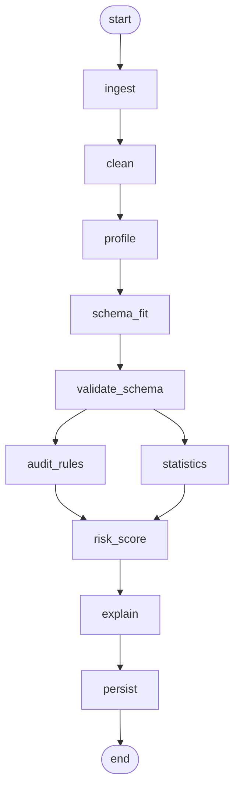

# Agentic AI Data Analysis Agent

A LangGraph-based audit analysis engine. It ingests a raw transactions file (CSV or XLSX), cleans it, fits it to a schema, and runs it through 15 audit rules plus a set of statistical checks. Findings get an LLM-generated audit-perspective explanation on top of the deterministic rule output, and the cleaned data can be queried directly with SQL (or with plain English, translated to SQL by an LLM).

## Key features

- Data ingestion and cleaning: ingests CSV and XLSX files, cleans them (whitespace, dates, nulls, dedup, with a change log), and infers column roles (vendor, amount, date, invoice number).
- Audit rules engine: 15 built-in rules (duplicate invoices, threshold breaches, weekend postings, dormant vendors, Benford's Law, and more), each toggleable per dataset with configurable thresholds.
- Statistical analysis: z-score and IQR outlier detection, month-over-month/quarter-over-quarter trend variance, and distribution analysis.
- LLM-powered explanations: LiteLLM (provider-agnostic, supports Gemini, OpenAI, Anthropic, Ollama, and others) enriches each deterministic finding with a richer explanation, falling back to the template explanation if the LLM call fails.
- Natural-language query: ask a question in plain English on the query page and get back a validated, read-only SQL query and its results, run against DuckDB.
- LangGraph pipeline: a 9-node StateGraph (ingest, clean, profile, schema_fit, validate_schema, audit_rules and statistics in parallel, risk_score, explain, persist), designed to be composable into a future multi-agent supervisor.

## LangGraph pipeline



`audit_rules` and `statistics` run in parallel once `validate_schema` passes, then fan into `risk_score`. This matches the node wiring in `backend/app/workflow/graph.py` exactly (see `backend/generate_workflow_image.py` for a PNG rendered straight from the compiled graph object).

## Tech stack

- Frontend: Next.js (dashboard, upload, findings review, data query)
- Backend API: FastAPI (REST endpoints, background job handling with progress polling)
- Agent orchestration: LangGraph
- LLM layer: LiteLLM, with a hosted model (Gemini) for NL-to-SQL and a local Ollama model for per-finding explanations
- In-memory SQL: DuckDB
- Database: SQLite with Alembic for migrations

## Running the app

Requires Python 3.11+ and Node 20+ (see `requirements.md` for the full dependency list).

### 1. Backend (FastAPI, port 8000)

```
cd backend
python -m venv venv
venv\Scripts\activate          # Windows (use `source venv/bin/activate` on macOS/Linux)
pip install -r requirements.txt
copy .env.template .env        # (`cp .env.template .env` on macOS/Linux) — then edit .env with your LLM key
alembic upgrade head           # creates/updates the SQLite database
uvicorn app.main:app --reload --port 8000
```

The API is now live at `http://localhost:8000` (docs at `http://localhost:8000/docs`).

### 2. Frontend (Next.js, port 3000)

In a second terminal:

```
cd frontend
npm install
npm run dev
```

Open `http://localhost:3000` in a browser. The frontend expects the backend to be running on `http://localhost:8000` (hardcoded in `frontend/src/lib/api.ts`), and the backend's CORS is locked to `http://localhost:3000`, so both must run on these exact ports.

## Configuring the LLM provider

The app defaults to Gemini (query generation) + a local Ollama model (per-finding explanations), since that's what the developer had free access to. If you only have an OpenAI or Azure OpenAI key, no code changes are needed — just edit `backend/.env` (copy it from `backend/.env.template` if you haven't already):

1. Open `backend/.env.template` and find the `Option B: OpenAI` / `Option C: Azure OpenAI` commented blocks under `--- LLM (Provider-Agnostic via LiteLLM) ---`.
2. Comment out the default (`Option A: Gemini`) lines and uncomment the block matching your provider, for both the main `LLM_MODEL` and the `FINDINGS_LLM_MODEL` sections.
3. Fill in your API key (and, for Azure, the endpoint/deployment name/API version).
4. Restart the backend.

This works because all LLM calls go through one provider-agnostic client (`backend/app/llm/client.py`, via LiteLLM) — switching provider is purely an env var change.

## Project structure

- `frontend/`: the Next.js frontend application.
- `backend/`: the FastAPI backend, LangGraph engine, audit rules, and LLM integration.
- `artifacts/`: project artifacts and generated outputs.
- `backend/uploads/`: local storage for uploaded and processed datasets.
- `INTERNSHIP_REPORT.md`: full writeup of the project.
